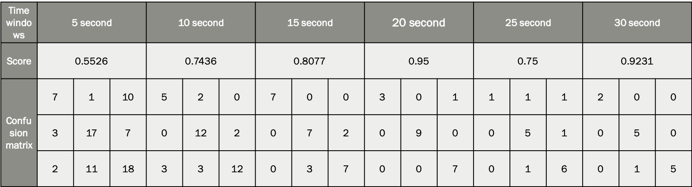

# GameBot detection
This project is a result of participation in __Samsung R&D Institute internship__ as a part of hands-on training at
__Mechanics and Mechanics faculty__ of __Taras Shevchenko National University of Kiev__.

# Plan
Our mentors provided us a simple game, in which were a player, coins, monsters and simple distractions (overlapping trees).

For picking up coins you recieve gold and for killing monsters – experience. Our practice consisted of several points:
- create a game bot to play this game,
- collect data sets including both human and bot samples,
- parse the data and extracte some features,
- visualize features,
- write classifiers based on different algorithms,
- use boosting approach,
- try to discriminate different people.

# Game bot
Game bot was written by collective efforts of all group members. It has abilities:
- to find effective ways to harvest greater number of gold/experience,
- to make random ”occasional” clicks in order to emulate human play style,
- to find ways out of dead ends.

# Collecting datasets
The data was successfully collected by several members of our team and distributed between us.

# Parser and feature extraction
Data is parsing from two log files, splitting on time blocks with constant length. In parallel, I am extracting features:
- clicks per minute,
- gold per minute,
- experience per minute,
- average holding time per minute,
- deviation of clicks,
- trajectory length,
- average distance between clicks,
- average time between clicks.

# Visualization
With __”permutation importance” method__ of feature selection (which implemented by eli5 module) were found that features
‘gpm’ (gold per minute), ‘tbc’ (time before clicks), ‘epm’ (experience per minute), ‘aht’ (average holding time) have
highest _feature importances_. After using __t-SNE algorithm__, we saw, that data is separable, but sometimes bot behaviour
is very similar to human.

More visualization in ``visualization.ipynb``

# Classification
I learned different classification algorithms and tested them. Additionally to standard __Logistic Regression__,
__Naive Bayes__, __k-Nearest Neighbors__, __Decision Tree__, __Random Forest__ algorithms, I investigated:
- __Extra Trees__ algorithm, which is pretty similar to _Random Forest_, but shows better performance in terms of overfitting,
- and __Voting Classifier__, which combines different simple models, and as a result it’s more stable on the ”real-life data”,
which can be much different from training.

Finally, I used exactly _Voting Classifier_ with majority of mentioned simple models. Also, _GridSearchCV_ was used to pick
up best parameters for inner models.
Best results were shown, when _20s time windows_ were used.

# Boosting
Comparing to __Ada Boost__, __Bagging__ showed up better performance and consequently was selected as main boosting algorithm.
As we can see from the table, after boosting the results became better on big time windows and stayed the same on smaller one.

All classification results you can find in ``classification.ipynb``.

# Human vs Human

Human discrimination suddenly turned out to be easier than _“bot vs human”_. Probably, the reason is that different people
have significantly different play styles, but our bot tries to copy more general human behavioural features, like
occasional clicks etc. Unfortunately, there were a few human logs, that belongs to one person, so ‘perfect’ accuracy
on big time windows are not so demonstrative. 

# Human vs Human vs Human

Discriminate three people became harder task, because two people were playing too similar (maybe that was the
same person playing differently), but results are still good enough (except 5 second time window). 

# Conclusions
In general, classifiers based only on selected behavioural features are able to discriminate bot and human good enough.

I came up to conclusion that optimal size for time window is 20 seconds, because it’s not small enough to have high bias
(to prevent ‘wrong blaming’), and not big enough to make our data more ‘blurry’.
